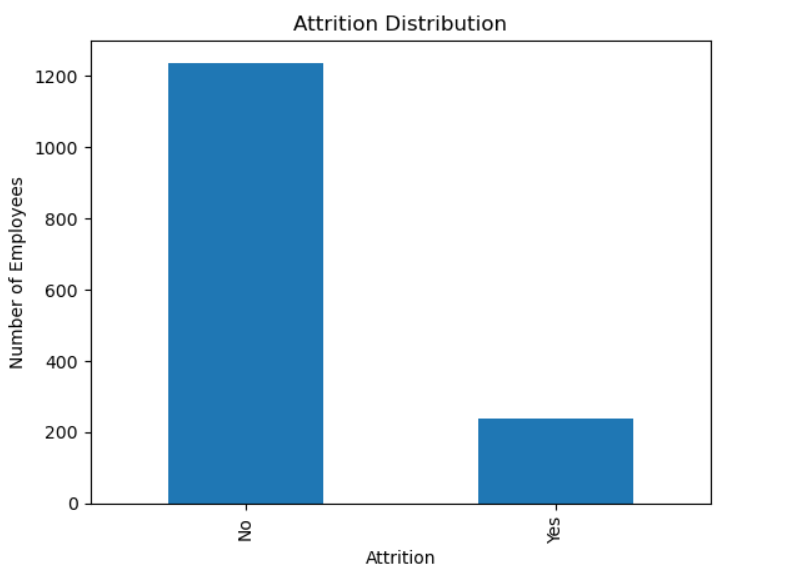
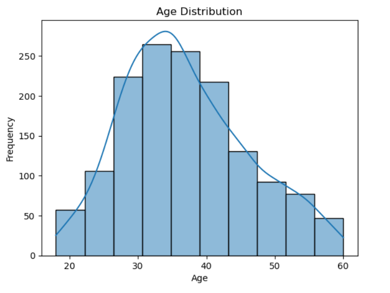
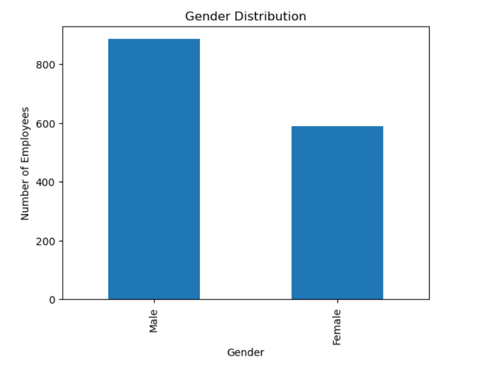
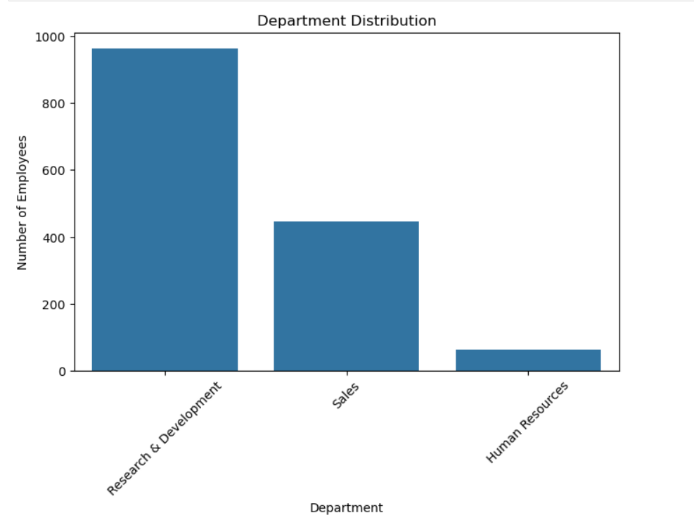
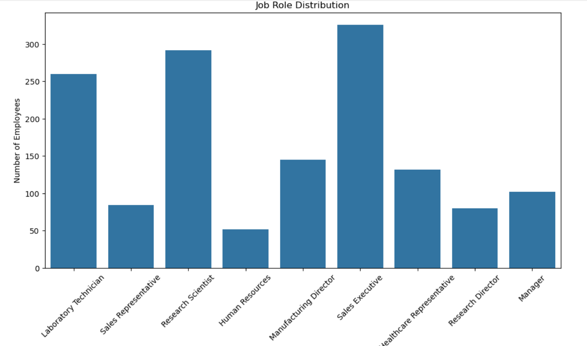
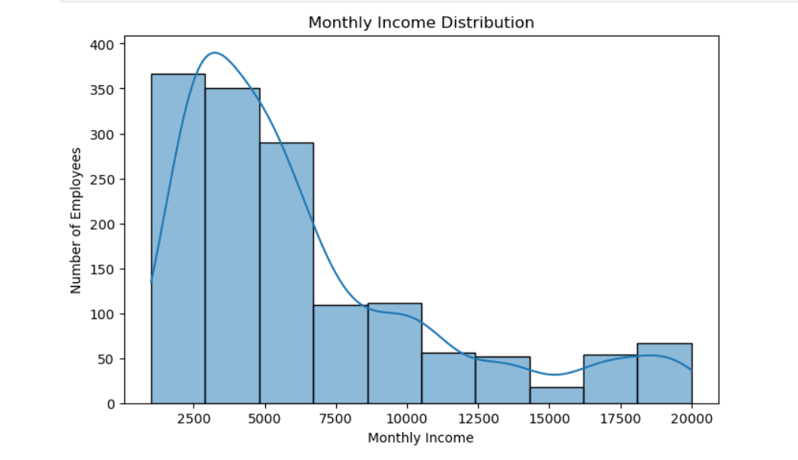
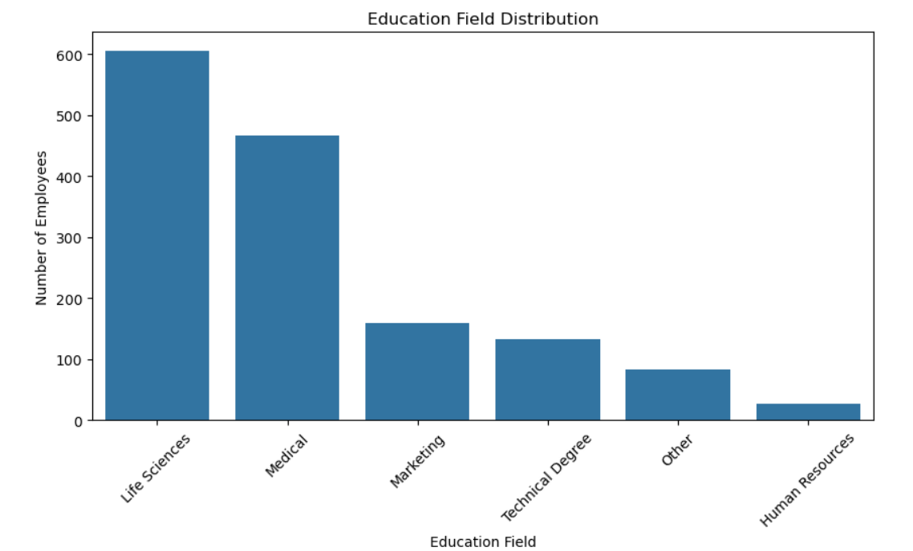
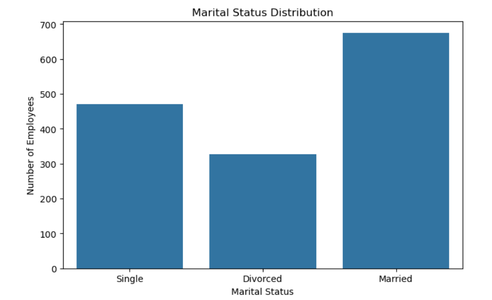
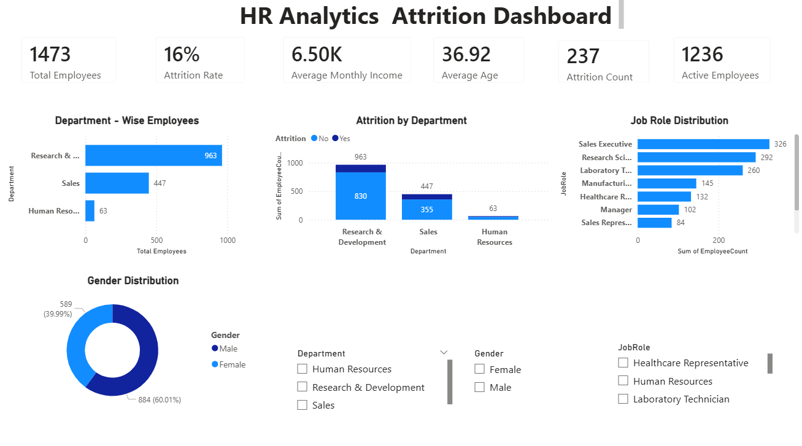
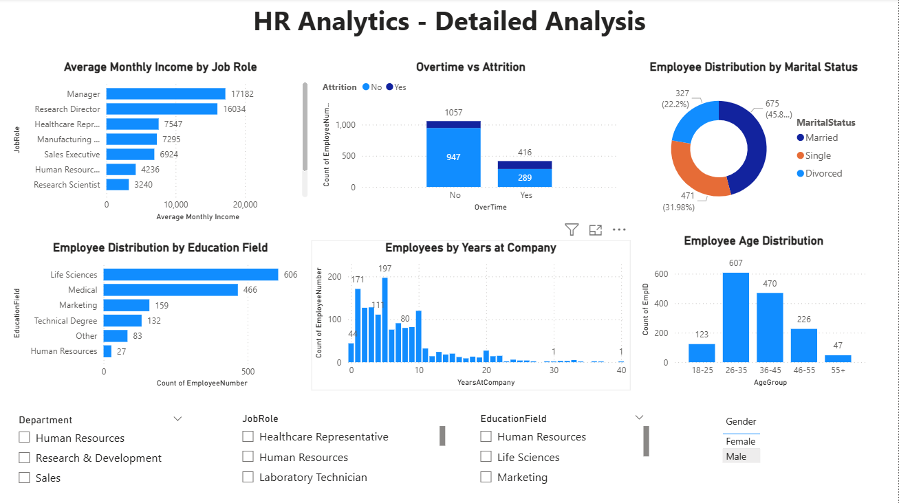

# 👥 HR Analytics End-to-End Project

## 📌 Project Overview

This project presents an end-to-end HR Analytics solution using **SQL, Python, Power BI, and Excel**. The objective is to analyse employee data, identify workforce trends, understand attrition patterns, and provide actionable business insights through data cleaning, exploratory data analysis (EDA), SQL analysis, and interactive dashboards.

---

## 🎯 Business Problem

Employee attrition can increase recruitment costs, reduce productivity, and impact business performance. HR teams need data-driven insights to understand why employees leave and identify areas where retention strategies can be improved.

---

## 🎯 Objectives

- Import and analyse HR employee data using SQL.
- Clean and preprocess the dataset using Python.
- Perform Exploratory Data Analysis (EDA).
- Analyse employee attrition across different demographics.
- Identify factors influencing employee retention.
- Develop interactive HR dashboards in Power BI.
- Generate actionable business recommendations.

---

## 🔄 Project Workflow

```
Raw Dataset
      │
      ▼
SQL Data Analysis
      │
      ▼
Python Data Cleaning
      │
      ▼
Exploratory Data Analysis (EDA)
      │
      ▼
Power BI Dashboard
      │
      ▼
Business Insights
      │
      ▼
Business Recommendations
```

---

## 🛠️ Tools & Technologies

- SQL (MySQL)
- Python
- Pandas
- NumPy
- Matplotlib
- Seaborn
- Power BI
- Microsoft Excel
- Jupyter Notebook

---

## 📂 Project Structure

- Dataset
- SQL Queries
- Python Notebooks
- requirements.txt
- Dashboard Screenshots
- Power BI Dashboard
- Project Report

---

## 🧹 Data Cleaning

Data preprocessing was performed using Python.

### Tasks Performed

- Checked missing values
- Removed duplicate records
- Standardized categorical values
- Corrected data types
- Created a cleaned dataset for analysis

---

## 🗄️ SQL Analysis

SQL was used to explore and analyse the HR dataset.

### Analysis Performed

- Employee Distribution
- Attrition Analysis
- Department Analysis
- Job Role Analysis
- Gender Distribution
- Education Field Analysis
- Monthly Income Analysis

---

# 📊 Exploratory Data Analysis (EDA)

The following visualisations were created using Python (Pandas, Matplotlib, and Seaborn).

---

## 📌 Attrition Distribution



**Insight:** The majority of employees stay with the company, while a smaller percentage have left, indicating overall attrition levels.

---

## 👥 Age Distribution



**Insight:** Most employees fall within the 26–35 age group, representing the largest portion of the workforce.

---

## 🚻 Gender Distribution



**Insight:** The workforce consists of both male and female employees, providing a balanced demographic overview.

---

## 🏢 Department Distribution



**Insight:** Research & Development has the highest number of employees, followed by Sales and Human Resources.

---

## 💼 Job Role Distribution



**Insight:** Sales Executive and Research Scientist are among the most common job roles in the organisation.

---

## 💰 Monthly Income Distribution



**Insight:** Most employees are concentrated in the lower to mid-income ranges, with fewer employees earning higher salaries.

---

## 🎓 Education Field Distribution



**Insight:** Life Sciences is the most common education background among employees.

---

## 💍 Marital Status Distribution



**Insight:** Married employees represent the largest workforce segment.

---

# 📈 Power BI Dashboard

## 📊 Executive Dashboard

This dashboard provides an overview of key HR metrics and workforce performance.

### Key Highlights

- Total Employees
- Attrition Rate
- Average Age
- Average Monthly Income
- Department-wise Analysis
- Interactive Filters



---

## 📊 Detailed Analysis Dashboard

This dashboard provides detailed insights into employee demographics, job roles, income distribution, education fields, and attrition.

### Key Highlights

- Department Analysis
- Job Role Analysis
- Gender Analysis
- Education Field Analysis
- Monthly Income Analysis
- Attrition Trends



---

# 📈 Key Business Insights

- Research & Development has the largest workforce.
- Sales shows comparatively higher employee attrition.
- Employees in lower income ranges tend to have higher attrition.
- Employees aged 26–35 form the largest age group.
- Life Sciences is the most common education field.
- Married employees make up the largest share of the workforce.

---

# 💡 Business Recommendations

- Improve employee engagement initiatives.
- Review compensation for roles with higher attrition.
- Strengthen career development and training opportunities.
- Monitor departments with higher employee turnover.
- Conduct regular employee satisfaction surveys.
- Use HR dashboards to monitor workforce trends continuously.

---

# ✅ Conclusion

This project demonstrates a complete HR Analytics workflow using SQL, Python, and Power BI. It covers data extraction, cleaning, exploratory data analysis, dashboard development, and business insights to support informed HR decision-making.

---

## 👨‍💻 Author

**Khushant Rathore**

Aspiring Data Analyst

**Skills:** SQL | Python | Power BI | Excel | Pandas | NumPy | Matplotlib | Seaborn
